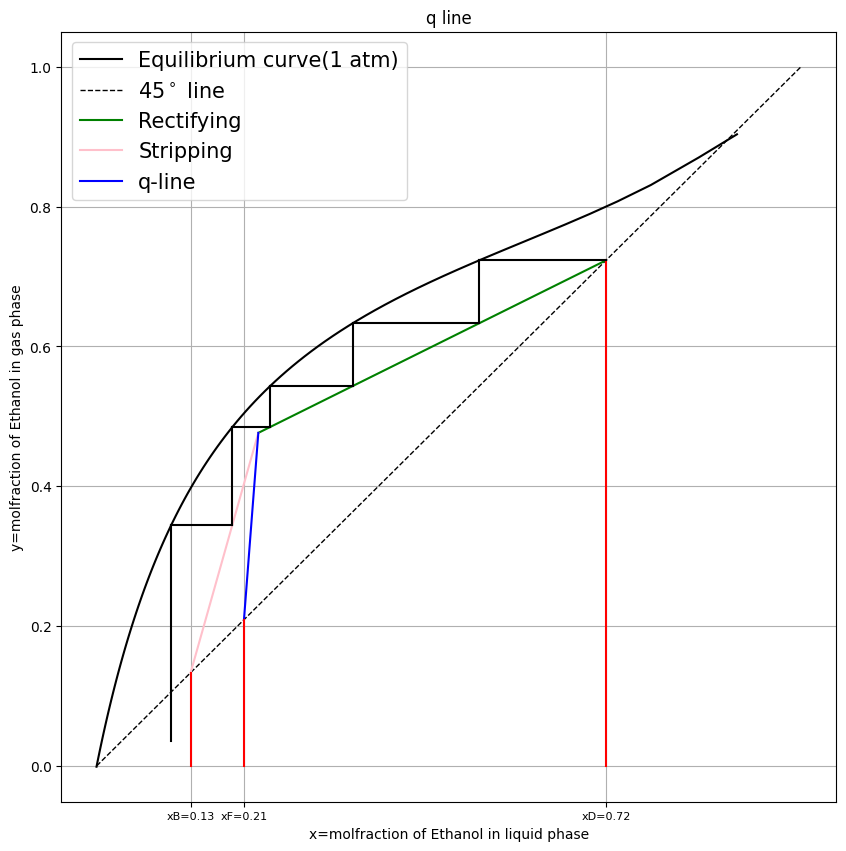

# Distilation Top

Distilation top is distilation mixture by reflux. \
We can solve theorical steps using Mccabe -Thiele methode.

In this experiment, we use Ethanol-water solution. And real step is 8.

### Mccabe-Thiele methode(q-line)

1. Plot liquid-gas phase molfraction equilibrium(1 atm) graph. \
   I use NRTL model to find gamma.
2. Plot Rectifying and stripping operating line.
3. Find dot of Rectifying and stripping line same.\
   and plot line between feed's molfractin( $x_D$ )\
   This line is q-line.
   $y=\frac{q}{q-1}x-\frac{x_D}{q-1}$
4. Start at dot of $x_D$-Rectifying line ( $x_D$ is Top solution molfraction)\
   step.

   

5. Calculated stage efficent using computer is 0.625 but hand used is 0.875.

### Process Simulation using `DWSIM`

`DWSIM` is open source process simulater.

##### Before reflux

Real experience molefraction data is: 
Feed: 0.2091
Top: 0.6699
Bottom: 0.07046

Simulated data 

Reflux ratio 0.2 (Realy in top, should be reflux)\
Except feed stage, condensor, reboiler, stage efficent is 0.625.

### 📊 Comparison of Distillation Column Simulation and Experimental Results

| Case | Stage (탑 내부 위치) | Water (Molar Fraction) | Ethanol (Molar Fraction) |
| :---: | :---: | :---: | :---: |
| **실제 실험치 (Target)** | **상부 (Top / 1단)**   **하부 (Bottom / Bottoms)** | -   - | **0.7231**   **0.1334** |
| **이론 8단**   (단 효율: 0.625) | **1 (Top / Condenser)**   2   3   4   5   6   7   8   9   **10 (Bottom / Reboiler)** | 0.261422   0.319773   0.355627   0.394237   0.439235   0.446717   0.461929   0.492531   0.552562   **0.662485** | **0.738578**   0.680227   0.644373   0.605763   0.560765   0.553283   0.538071   0.507469   0.447438   **0.337515** |
| **이론 5단**   (단 효율: 1.0) | **1 (Top / Condenser)**   2   3   4   5   6   **7 (Bottom / Reboiler)** | 0.245415   0.291727   0.334744   0.382732   0.446335   0.490011   **0.662928** | **0.754585**   0.708273   0.665256   0.617268   0.553665   0.509989   **0.337072** |
| **이론 7단**   (단 효율: 1.0) | **1 (Top / Condenser)**   2   3   4   5   6   7   8   **9 (Bottom / Reboiler)** | 0.228772   0.264322   0.294599   0.323851   0.355828   0.395547   0.449960   0.492919   **0.662485** | **0.771228**   0.735678   0.705401   0.676149   0.644172   0.604453   0.550040   0.507081   **0.337515** |

We measured top vapor condensered(condensor; stage 1) and bottom(reboiler;stage 10) liquid.
