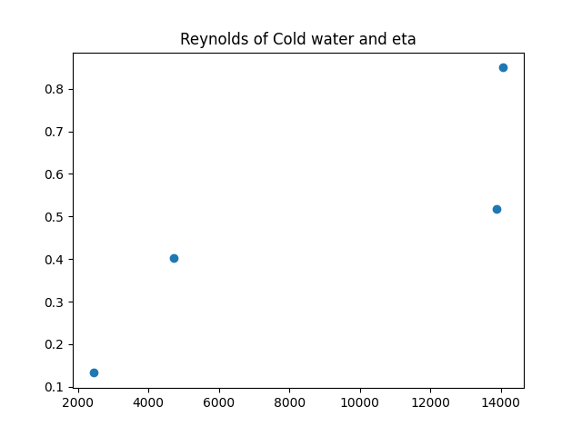
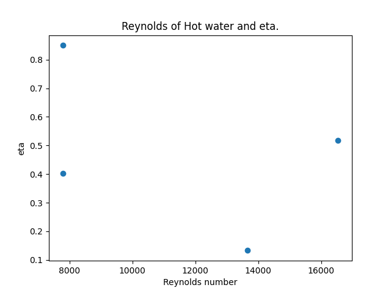

## Double Pipe Heat Exchanger Analysis

This repository contains the code and data used in a double pipe heat exchanger experiment.

Experimental data were recorded in an Excel file and processed using **pandas** in Python.  
All computations were performed locally using **Jupyter Lab**.

### Workflow

- Raw experimental data are entered in the `_frame` sheet  
- Calculations are performed using Python (pandas)  
- Results are written to the `_result` sheet  

### Analysis

The following relationships were analyzed:

- Reynolds number of **cold water vs. effectiveness**  
- Reynolds number of **hot water vs. effectiveness**

Effectiveness is defined as:

### Limitations and Notes

- The experimental data may contain inconsistencies, and some calculated results are likely inaccurate.  
- Part of the data was initially processed using Excel, and discrepancies were identified during verification.  
- Independent validation (e.g., manual calculations) was not fully performed at the time of the experiment.  
- The current code does not handle missing values (`NaN`) robustly, which may prevent calculations from running properly in some cases.  

These limitations should be considered when interpreting the results.

