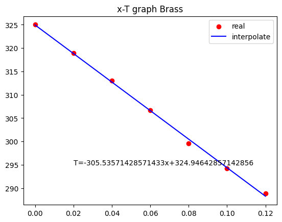
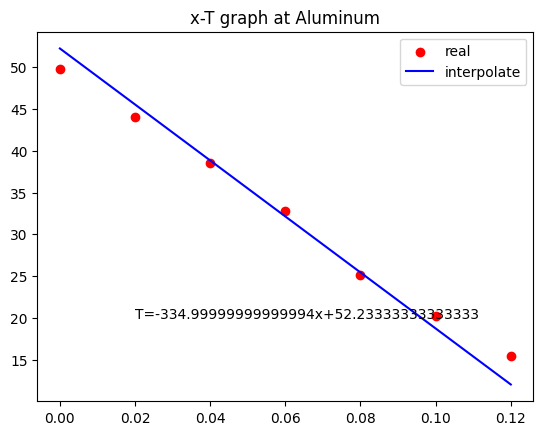

# Heat Conductivity

Measure Heat conductiviry(k) brass, aluminum, stainless, copper.

Input data at `k_frame.xlsx` \
Calculate at `conductivity.ipynb` 

---

### Things

Assume Heat steady state.\
I calculate Brass(type CZ121), Aluminum,Stainless,Copper. \
k in book data  is 123, 170, 16, 338 \
Unit is 

$$
\frac{W}{m K} $$

Machine's Heat bar is brass. \
Without Brass,  measure Temperature's gradient at only "x[2],x[3],x[4]" .

---

### Result

Calculate with code is : \
Brass,138.908, error is 0.12 \
Aluminum, 126.6905019636978, error is 0.25476175 

How calculate Error is

$$
\frac{|k_{real}-k_{calculate}|}{k_{real}} $$

